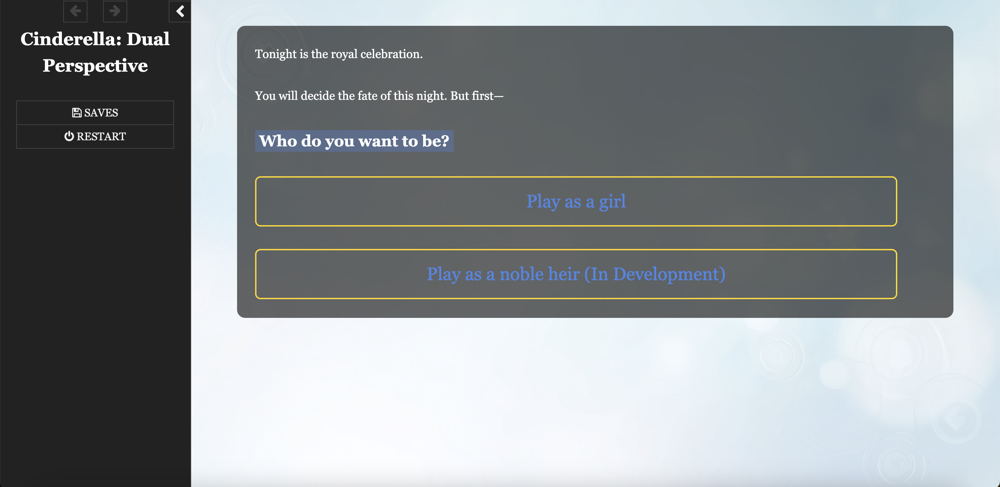

# Cinderella: Dual Perspective

An interactive fiction game based on the classic fairy tale, offering story experiences from different character perspectives.



## Game Overview

"Cinderella: Dual Perspective" is a choice-based interactive fiction game that reimagines the classic fairy tale. You can choose to play as "Cinderella" or "The Noble Heir" (coming soon) and experience this story about identity, choices, and destiny through different perspectives.

Each decision affects the direction of the story, leading you to different endings. Will you choose to conform or rebel? Will you embrace opportunity or avoid risk? Your choices will determine how the story unfolds.

## Features

- **Multiple Perspectives**: Experience the same story through different characters' eyes
- **Multiple Endings**: Discover various possible outcomes based on your choices
- **Elegant Design**: Polished user interface and visual design
- **Immersive Experience**: Get immersed in the story through carefully crafted narrative and character interactions
- **Auto-save**: The game remembers your progress

## Play Online

You can play the game online through this link:
[https://666feiyu666.github.io/dn-cinderella/](https://666feiyu666.github.io/dn-cinderella/)

## Technical Details

This project was built using the following technologies:

- **Twine**: Interactive non-linear story creation tool
- **SugarCube**: Twine story format
- **Tweego**: Command-line compilation tool
- **HTML/CSS**: Frontend interface design
- **JavaScript**: Enhanced functionality and interactions

## Running Locally

If you want to run or modify this project locally:

1. Clone the repository:
   ```bash
   git clone https://github.com/666feiyu666/dn-cinderella.git
   ```

2. Make sure you have Tweego (Twine's command-line compiler) installed:
   ```bash
   # Install on macOS using Homebrew
   brew install tweego
   ```

3. Compile the project:
   ```bash
   tweego cinderella.tw -o index.html --format sugarcube-2
   ```

4. Open the `index.html` file in your browser

## Development Guide

### Source File Structure

- `cinderella.tw`: Main story source file
- `css/`: Stylesheet directory
  - `main.css`: Main styles
- `assets/`: Resources directory
  - `bg.png`: Background image

### Editing the Story

You can edit the `.tw` file using any text editor, or import and edit the story file using the Twine 2.0 graphical editor.

## Contributing Guidelines

Contributions are welcome! If you'd like to contribute to the project:

1. Fork this repository
2. Create your feature branch (`git checkout -b feature/amazing-feature`)
3. Commit your changes (`git commit -m 'Add some amazing feature'`)
4. Push to the branch (`git push origin feature/amazing-feature`)
5. Open a Pull Request

## License

This project is licensed under the MIT License - see the [LICENSE](LICENSE) file for details.

## Acknowledgments

- Inspired by the classic fairy tale "Cinderella"
- Built on Twine and SugarCube
- Thanks to all friends who tested and provided feedback

---

© 2025 [Your Name]. All rights reserved.